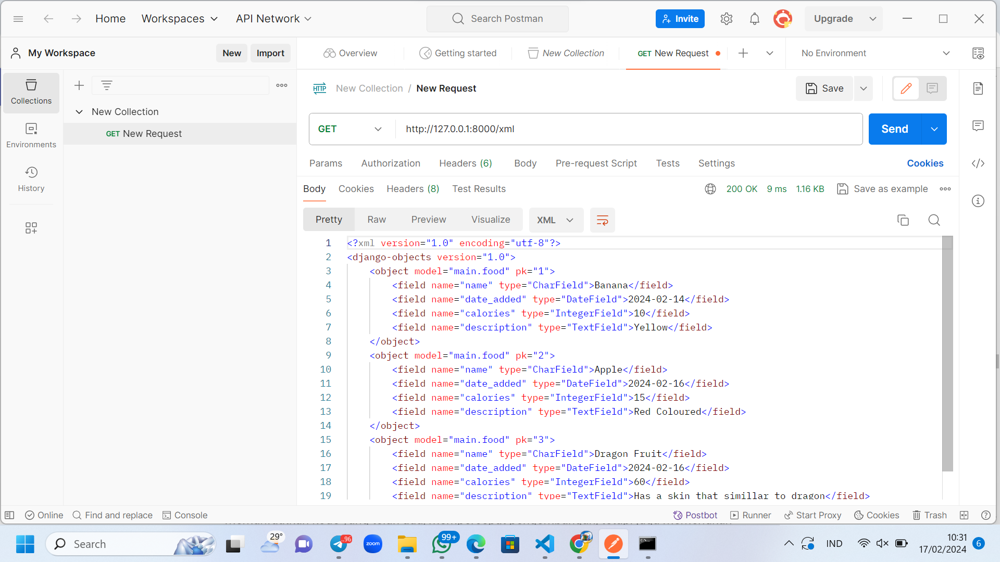

# Healthy Food Tracker
## Tugas 2
- ### Membuat sebuah proyek Django baru

    a. Langkah pertama adalah saya membuat direktori baru yang bernama healthy-food-tracker pada komputer saya lalu saya membuka command prompt dan membuat virtual environment dengan perintah 

   ```
    python -m venv env 
   ```
   Lalu setelah menambahkan virtual enviroment,tidak lupa untuk menjalankan virtual environment dengan perintah sebagai berikut 

   ```
   env\Scripts\activate
   ```
   Dengan begitu sudah keluar tanda aktifnya virtual environment dengan (env) dibagaian paling depan setiap perintah di command prompter.

    b. Selanjutnya saya mengisolasi dependencies dan menciptakan proyek Django yang baru.Yang pertama dalam tahap ini saya menambahkan di dalam folder Healthy-Food-Tracker yaitu berkas requirements.txt yang akan diisi dengan dependencies yaitu

    ```
    django
    gunicorn
    whitenoise
    psycopg2-binary
    requests
    urllib3
    ```
    Setelah itu saya melakukan instalasi dependencies dan tetap menajalankan virtual environment yang sudsah saya jalankan sebelumnya. Perintah yang saya jalankan di command prompter adalah 
    ```
    pip install -r requirements.txt
    ```
    Lalu menambahkan proyek baru yang bernama healthy_food_tracker dengan perintah di command prompter 
    ```
    django-admin startproject healthy_food_tracker .
    ```
    c. Saya juga melakukan konfigurasi  setelahnya dan tidak lupa menjalankan server dengan menambahkan tanda bintang diantar kurung dibagian ALLOWED_HOSTS yang ada di settings.py (kalau saya menggunakan visual studio code) yang berguna untuk deployment dengan perintah
    ```
    ...
    ALLOWED_HOSTS = ["*"]
    ...
    ```
    Step berikutnya saya membuka berkas manage.py pada direktori yang sudah diaktifkan pada command prompter sebelumnya yang sudah dijalankan. Menggunakan server Django dan memberi perintah 
    ```
    python manage.py runserver
    ```
    Karena saya menggunakan windows maka saya menggunakan perintah itu. Dan untuk memastikan keberhasilan Django yang telah saya buat, saya membuka link ini http://localhost:8000/ dan saya mendapatkan animasi roket yang aktif dan artinya sudah berhasil.

 - ### Membuat aplikasi dengan nama main pada proyek tersebut.
    
    a. Pada bagian ini, untuk membuat aplikasi baru saya melakukannya dengan perintah di command prompter yang sudah dijalankan virtual environment sebelumnya yaitu
    ```
    python manage.py startapp main
    ```
    Dengan perintah yang diatas, terciptalah direktori baru dengan nama main yang berisis struktur awal mengenai aplikasi yang akan saya buat .

    Lalu saya buka visual studio code dan mendaftarkan aplikasi main ke dalam proyek. Saya membuka berkasi settings.py yang ada didalam direktori proyek healthy
    _food_tracker dan mencari variabel INSTALLED_APPS dan menambahkan 'main' seperti ini
    ```
    INSTALLED_APPS = [
    ...,
    'main',
    ...
    ]
    ```


 - ### Membuat model pada aplikasi main dengan nama Item dan memiliki atribut wajib sebagai berikut.
    
    A. name sebagai nama item dengan tipe CharField.

    B. amount sebagai jumlah item dengan tipe IntegerField.

    C. description sebagai deskripsi item dengan tipe TextField.

    a. Untuk tahap ini pertama saya membuka berkas models.py yang ada di dalam aplikasi main pada visual studio code saya dan mengisi berkas tersebut dengan kode ini
    ```
    from django.db import models

    class food(models.Model):
    name = models.CharField(max_length=255)
    date_added = models.DateField(auto_now_add=True)
    calories = models.IntegerField()
    description = models.TextField()
    ```


 - ### Membuat sebuah fungsi pada views.py untuk dikembalikan ke dalam sebuah template HTML yang menampilkan nama aplikasi serta nama dan kelas kamu.

    a. Dan tahap ini saya hanya mengecek apakah sudahnya ada perintah didalam berkas views.py yang terletak di berkas aplikasi main saya pada visual studio code saya.Berikut perintah yang saya cek 

    ```
    from django.shortcuts import render
    ```

    Dan memang sudah ada. Setelah itu saya menambahkan lagi isi dibawah from django.shortcuts import render, dengan

    ```
    def show_main(request):
    context = {
        'name': 'Gistela Namasya Sinurat',
        'class': 'PBP A'
    }

    return render(request, "main.html", context)
    ```


 - ### Melakukan routing pada proyek agar dapat menjalankan aplikasi main.
- ### Membuat sebuah routing pada urls.py aplikasi main untuk memetakan fungsi yang telah dibuat pada views.py.

    Dan untuk kedua poin ini akan saya paparkan dengan bersamaan. 

    Pertama saya menambahkan new file pada visual studio code saya dengan nama urls.py dan menambahkannya kedalam berkas main. Lalu saya membuka berkas urls.py di visual studio code saya yang sebelumnya ada di berkas healthy_food_tracker dan mencari from django.urls import path dan menambahkan , include disampingnya. Dan juga saya merubah variabel urlpatterns . menjadi

    ```
    urlpatterns = [
    ...
    path('', include('main.urls')),
    ...
    ]
    ```

- ### Melakukan deployment ke PWS terhadap aplikasi yang sudah dibuat sehingga nantinya dapat diakses oleh teman-temanmu melalui Internet.

- ### Membuat sebuah README.md yang berisi tautan menuju aplikasi PWS yang sudah di-deploy, serta jawaban dari beberapa pertanyaan berikut.

A. Jelaskan bagaimana cara kamu mengimplementasikan checklist di atas secara step-by-step (bukan hanya sekadar mengikuti tutorial).

B. Buatlah bagan yang berisi request client ke web aplikasi berbasis Django beserta responnya dan jelaskan pada bagan tersebut kaitan antara urls.py, views.py, models.py, dan berkas html.

C. Jelaskan mengapa kita menggunakan virtual environment? Apakah kita tetap dapat membuat aplikasi web berbasis Django tanpa menggunakan virtual environment?

D. Jelaskan apakah itu MVC, MVT, MVVM dan perbedaan dari ketiganya.

 A. Untuk poin ini sudah saya paparkan di berkas README. md ini

 B. Susah ada penjelasan di atas.

 C. Virtual environment (lingkungan virtual) adalah alat yang memungkinkan Anda untuk membuat lingkungan Python terisolasi. ada beberapa alasan digunakannya virtual enviroment dalam pengembangan aplikasi web berbasis Django : Isolasi Dependensi:  Dengan virtual environment, Anda dapat memiliki beberapa versi Python di komputer Anda tanpa bentrokan. Setiap versi dapat dianggap sebagai lingkungan pengembangan yang terpisah. Anda dapat menginstal versi berbeda dari pustaka dan modul Python secara terisolasi. Ini sangat penting karena memungkinkan Anda menghindari konflik antara versi ketika bekerja pada beberapa proyek. 

   1.	Isolasi Dependensi Virtual environment dapat memeberi pengguna untuk memiliki beberapa versi python dikomputernya tanpa bentrok. Di tiap versi bisa dianggap sebagai lingkungan pengembangan yang terpisah. Dan juga pengguna dapat menginstal versi berbeda dari pustaka dan modul python secara terisolasi. Penting adanya karena dapat memberikan kemungkinan untuk terhindar dari konfil antara versi di berbagai pekerjaan proyek pengguna.

   2.	Kepatuahan Versi 
    Virtual environment memberikan kemungkinan para pengguna dalam menentukan dan mengelola versi yang tepat dari Django dan dependensinya untuk di berbagai proyek. Dapat memastikan untuk proyek pengguna pasti kompatibel dengan versi yang digunakan saat pengembangan, walaupun nantinya pengguna ingin mengupgrade Django ataupun pustaka lain untuk berbagai proyek.

   3.	Kebersihan dan Keamanan
    Adanya Virtual environment, pengguna dapat memastikan pengembangan dan pemeliharaan proyek Django dan tidak mengkhawatirkan konflik dependensi.

   4.	Pengujian
    Pengujian sangat penting untuk virtual environment. Jika pengguna hendak mengganti versi Django didalam aplikasi web dari 1.5 ke 1.9, pengguna tiak sulit untuk menjalankannya dan membuat virtual environment yang baru lalu dapat menginstal versi Django yang lain.

   Walaupun pengguna tidak diwajibkan untuk menggunakan virtual environment, lebih baik dan disarankan agar pengguna tetap menggunakannya dengan cara pengaplikasian yang mudah yaitu membuat virtual environment yang baru lalu mengaktifkan virtual environment dan akhirnya bisa mengembangkan aplikasi web Django yang jauh dari konflik dependensi.

   D. 

   1. Model-View-Controller (MVC):
   - Model: Mewakili data dan bisnis logic aplikasi.
   - View: Bertanggung jawab untuk menampilkan data dari model.
   - Controller: Berperan sebagai penghubung antara model dan view. Mengatur interaksi pengguna dan mengubah status model dan view.
   - Perbedaan: Pada MVC, view adalah struktur aktif yang meminta informasi dari model. Controller hanya mengubah status model dan view.

   2. Model-View-Template (MVT):
   - Model: Sama seperti pada MVC, mewakili data dan bisnis logic.
   - View: Menampilkan data dari model.
   - Template: Bertanggung jawab untuk menghasilkan tampilan HTML. Mirip dengan view pada MVC.
   - Perbedaan : MVT adalah varian dari MVC yang lebih umum digunakan dalam kerangka kerja web Django. Template menggantikan peran view dalam menghasilkan tampilan.

   3. Model-View-ViewModel (MVVM):
   - Model: Data dan bisnis logic, sama seperti pada MVC dan MVT.
   - View: Menampilkan data dari model.
   - ViewModel: Berperan sebagai penghubung antara view dan model. ViewModel memanipulasi informasi sebelum melewatkan ke view.
   - Perbedaan: MVVM digunakan ketika ada antarmuka pengguna yang sudah ada (misalnya, UI yang tidak dapat diubah) dan model yang sudah ada. ViewModel membantu mengintegrasikan keduanya.

   secara singkat:
   - MVC: View aktif, controller mengubah model dan view.
   - MVT: Mirip dengan MVC, tetapi menggunakan template untuk tampilan.
   - MVVM: ViewModel memanipulasi data sebelum ditampilkan di view.

## TUGAS 3

- ### Apa perbedaan antara form POST dan form GET dalam Django?

   Perbedaan diantara form POST dan form GET dalam Django adalah :

   a. Form POST
   
   1.  Dalam penampungan data atau nilai yang dikirimkan memakai variabel request.POST
   2. Pemakaian form POST lebih baik digunakan untuk pengiriman daya yang rahasia, file, memiliki teks yang panjang bahakan data yang lebih besar atau lebih kompleks
   3. Form POST tidak perlu menampilkan URL tetapi dapat mengirimkan data langsung ke action

   b. Form GET

   1. Dalam pengaksesan data atau nilai yang diterima bisa dengan menggunakan variabel request.GET
   2. Berbeda dengan form POST, form GET menunjukkan data atau nilai ada pada URL setelah itu menampungnya dengan action
   3. Kalau untuk cakupan parameter tertentu yang dalam pembagian URl atau untuk penggunaan permintaan pencarian form GET lah yang cocok digunakan

   Dengan kesimpulan form GET untuk yang ingin dalam pembagian URL, pemunculan data pada URL atau permintaan pencarian dan form POST penggunaan dalam pengiriman data yang besar dan kompleks yang dikirim secara langsung.

- ### Apa perbedaan utama antara XML, JSON, dan HTML dalam konteks pengiriman data?

   a. XML (Extensible Markup Language)

   1. Penggunaan : Untuk pertukaran data dalam aplikasi bisnis dan enterprise XML adalah pilihan yang tepat.

   2. Struktur : XML merupakan bahasa markup yang penggunaanya untuk pembuatan dokumen yang dapat dibaca oleh mesin ataupun manusia. Penggunaan XML tepatnya untuk data yang sangat terstruktur dan kompleks contohnya adalah laporan keuangan atau pun dokumen.

   3. Kelebihan : Dapat digunakan di berbagai platform ataupun bahasa.

   4. Kekurangan : Penyimpanan yang besar sehingga mengakibatkan pengoperasian yang lambat

   b. JSON (JavaScript Object Notation) :

   Dengan JSON tipe data yang terbatas yaitu string, angka, dan objek dapat didukung. Dan juga JSON memiliki sifat yang ringkas dan menyesuaikan. Untuk merepresentasikan data di JSON digunakan dengan pasangan kunci-kunci. Pertukaran data JSON dapat dibaca oleh mesin maupun manusia.

   c. HTML (Hypertext Markup Language)
      Berguna untuk menampilkan data dengan bersifat statis dan digunakan juga untuk membuat halaman web. Format tampilan data merupakan fokus utama dari HTML dan HTML merupakan bahasa markah yang berguna untuk menampilkan daya di web.

   Untuk kesimpulan dimana HTML condong ke penampilan data dan pembangunan halaman web, XML berguna untuk pertukaran data yang lebih terstruktur, dan yang terakhir yaitu JSON cenderung yang bersifat fleksibel atau menyesuaikan dan biasnya digunakan pada API.

- ### Mengapa JSON sering digunakan dalam pertukaran data antara aplikasi web modern?


   Dikarenakan ke fleksibiltasannya dan mudahnya pemakaiannya maka JSON lebih cocok dipakai untu penanganan API dan tidak hanya menggunkanakn JavaScript tetapi berbagai bahasa pemrograman dapat digunakan. Selain itu JSON juga tidak perlu menggunakan tanda-tanda khusus seperti di XML karena JSON bersifat lebih intuitif dan artinya manusia lebih mudah untuk memahami. Tidak seperti XML juga, JSON memiliki ukuran fileyang kecil sehingga bisa lebih cepat  dalam pengiriman data dan meminimalkan penggunaan bandwidth.


- ### Jelaskan bagaimana cara kamu mengimplementasikan checklist di atas secara step-by-step


   Pertama saya menambahkan file baru pada direktori utama saya yang bernama base.html yang diisi dengan kode berikut :
   ```
      
   <!DOCTYPE html>
   <html lang="en">
      <head>
         <meta charset="UTF-8" />
         <meta name="viewport" content="width=device-width, initial-scale=1.0" />
       
      </head>

      <body>
       
      </body>
   </html> 
   ```


   Setelah itu saya membuka settings.py yang ada pada direktori templates di direktori healthy_food_tracker dan mengubah sebagian menjadi kode berikut :
   ```
   TEMPLATES = [
      {
         'BACKEND': 'django.template.backends.django DjangoTemplates',
         'DIRS': [BASE_DIR / 'templates'], # Tambahkan konten baris ini
         'APP_DIRS': True,
         ...
      }
   ]
   ```

- #### Membuat input form untuk menambahkan objek model pada app sebelumnya.

   Langkah selanjutnya saya menambah file baru dan memasukkannya ke direktori main melalu visual studio code dan mengisi dengan kode berikut :
   ```
   from django.forms import ModelForm
   from main.models import Food

   class FoodFormBookForm(ModelForm):
      class Meta:
        model = Food
        fields = ["name", "calories", "description"]   
   ```

   Dan setelah itu saya membuka direktori views.py pada main dan menambahkan beberaoa kode kedalamnya di bagian paling atas yaitu :
   ```
   from django.shortcuts import render, redirect   # Tambahkan import redirect di baris ini
   from main.forms import FoodForm
   from main.models import Food
   ```

   Masih di file yang sama yaitu file viewa.py saya menambahkan kode yang berguna untuk menambah jenis makanan sehat di formulir secara otomatis ketika meng submit di formulir yang akan diciptakan dengan :
   ```
   def create_food(request):
    form = FoodForm(request.POST or None)

    if form.is_valid() and request.method == "POST":
        form.save()
        return redirect('main:show_main')

    context = {'form': form}
    return render(request, "create_food.html", context)
    ```

    Saya menambahkan beberapa fungsi pada bagian show_main pada file views.py yang masih di main dengan kode :
   ```
   def show_main(request):
    foods = food.objects.all()

    context = {
        'name': 'Gistela Namasya Sinurat',
        'class': 'PBP A',
        'foods': foods
    }

    return render(request, "main.html", context)
    ```

   Lalu saya membuka file urls.py yang ada di main dan mengubah fungsi menjadi :
   ```
   from main.views import show_main, create_food
   ```

   Dan saya menambahkan path url tetap masih di file urls.py yang sama di fungsi urlpatterns dengan :
   ```
   path('create-food', create_food, name='create_food'),
   ```

   Setelah itu saya membuat file baru yang bernama create_food.html yang say masukkan ke direktori templates yang ada di main dan mengisinya dengan kode :

   ```
    
       <h1>Add New Food</h1>

   <form method="POST">
   
   <table>
      {{ form.as_table }}
      <tr>
         <td></td>
         <td>
         <input type="submit" value="Add Food" />
         </td>
      </tr>
   </table>
   </form>

              
   ```

   Selanjutnya saya membuka file main.html dan menambahkan kode :

   ```
   <table>
   <tr>
      <th>Name</th>
      <th>Calories</th>
      <th>Description</th>
      <th>Date Added</th>
   </tr>

    Berikut cara memperlihatkan data produk di bawah baris ini
   
   <tr>
      <td>{{food.name}}</td>
      <td>{{food.calories}}</td>
      <td>{{food.description}}</td>
      <td>{{food.date_added}}</td>
   </tr>
   
   </table>

   <br />

   <a href="">
   <button>Add New Food</button>
   </a>
   
   ```

   Setelah itu saya membuka file views.py pada main dan menambahkan kode pada bagian paling atas dengan :
   ```
   from django.http import HttpResponse
   from django.core import serializers
   ```

   Dan juga dibagian menambahkan kode ini :
   ```
   def show_xml(request):
      data = Food.objects.all()
   ```

   Langkah berikutnya saya membuka file urls.py msih di main dan mengubah bagian kode menjadi :
   ```
   from main.views import show_main, create_food, show_xml
   ```

   Masih di file yang sama dan menambahkan kode :
   ```
   ...
   path('xml/', show_xml, name='show_xml'),
   ...
   ```

   Lalu saya menjalankan pada command prompter dengan perintah python manage.py runserver dengan virtual environment yang sudah katif lalu membuka pada browser dan Healthy Food Tracker Page sudah ada hasilnya.

   Langkah selanjutnya adalah saya membuka file views.py pada main dan menambah kode berikut :
   ```
   def show_json(request):
      data = Book.objects.all()
      return HttpResponse(serializers.serialize("json", data), content_type="application/json") 
   ```

   Lalu saya membuka file urls.py yang ada pada di main dan mengubah kode menjadi :
   ```
   from main.views import show_main, create_book, show_xml, show_json
   ```

   dan menambahkan kode ini masih pada file urls.py yang sama :
   ```
   ...
   path('json/', show_json, name='show_json'),
   ...
   ```

   Lalu saya membuka file views.py pada  main dan menambahkan kode berikut :
   ```
   def show_xml_by_id(request, id):
      data = Food.objects.filter(pk=id)
      return HttpResponse(serializers.serialize("xml", data), content_type="application/xml")
   ```

   dan

   ```
   def show_json_by_id(request, id):
      data = Food.objects.filter(pk=id)
      return HttpResponse(serializers.serialize("json", data), content_type="application/json")
   ```

   Setelah itu saya membuka file urls.py yang ada pada main dan mengubah kode menjadi :
   ```
   from main.views import show_main, create_book, show_xml, show_json, show_xml_by_id, show_json_by_id
   ```

   dan menambahkan kode berikut :
   ```
   ...
   path('xml/<int:id>/', show_xml_by_id, name='show_xml_by_id'),
   path('json/<int:id>/', show_json_by_id, name='show_json_by_id'),
   ...
   ```

   Dan untuk meilhat hasilnya saya memakai command prompter yang tadi dan menjalankan perintah python manage.py runserver dan membuka pada browser dan keluarlah hasilnya.

- ###  Mengakses keempat URL di poin 2 menggunakan Postman, membuat screenshot dari hasil akses URL pada Postman, dan menambahkannya ke dalam README.md

   1. 

   2. 

   3. 

   4. 

- ## TUGAS 4
- ### Apa itu Django UserCreationForm, dan jelaskan apa kelebihan dan kekurangannya?

   Django UserCreationForm adalah dapat diartikan sesuai namanya yaitu pembuatan form bawaan dari Djano untuk pengguna baru di aplikasi web. Di form ini terxapat 3 bagian yaitu nama pengguna (username), kata sandi (password1), dan juga konfirmasi kata sandi (password2).
   Dan untuk kelebihan dan kekurangannya adalah sebagai berikut :

   a. Kelebihan

  -   Integrasi dengan Model user 
      UserCreationForm sudah terhubung langsung dengan Model user bawaan, jadi tidak perlu lagi melakukan perubahan untuk Model user.

  -   Sederhana

      Maksud sederhana disini ada dalam penggunaan UserCreationForm ini cukup dengan mengisi secara implementasi standar dalam pendaftaran pengguna baru tanpa harus menambahkan kode khusus. 

  -   Fleksibel

      Termasuk fleksibel karena bisa bebas penggunaannya dalam mengatur tampilan bisa dengan CSS atau juga dengan merubah widget bawaan

  -   Validasi Otomatis

      Form ini juga sudah termasuk dengan sistem memvalidasi secara otomatis dalam pendaftaran kata sandi pengguna baru apakah sudah layak dan sesuai dengan ketentuan.

   b. Kekurangan

  -   Kurangnya Fitur Lain

      Untuk fitur tambahan perlu menambahkan nya secara sendiri atau terpisah tidak secara otomatis. Contoh fitur lain yang dimaksud adalah reset kata sandi, profil email, atau pun verifikasi email.

  -   Beberapa field terbatas

      pada UserCreationForm hanya menyediakan field username dan password. Untuk penambahan field lainnya diperlukan untuk menambahkan form secara mandiri.

  -   Tidak Konfirmasi Email

      Seperti yang sudah disebutkan diatas bahwa UserCreationForm tidak memerlukan konfirmasi email dalam pembuatan akun, dengan begitu kuranglah sisi keamanannya.

   Bisa dismpulkan bahwa UserCreationForm merupakan alat yang  mudah dan praktis bagi pengguna baru, tetapi perlu dipertimbangkan sisi kekurangannya untuk memenuhi kebutuhan khusus sebuah aplikasi.


- ### Apa perbedaan antara autentikasi dan otorisasi dalam konteks Django, dan mengapa keduanya penting?

   Autentikasi dan otorisasi jelas adalah dua hal yang berbeda jika dalam Django. Nammun keduanya merupakan hal yang penting dalam mengelola keamanan maupun hak ases untuk aplikasi web. Berikut perbedaan keduanya :

   a. Autentikasi :

      - Penggunaan autentikasi adalah bertujuan dalam memvalidasi akun pengguna dengan pembuatan akun yang berisikan username (nama) dan juga kata sandi (password)

      - Digunakan autentikasi juga untuk memastikan ketika ingin login apakah benar bahwa akun dan juga pengguna yang sebenarnya

      - Dan juga dengan adanya autentikasi dapat menyesuaikan jika pengguna dan akun yang tepat bisa menggunakan layanan aplikasi yang sesuai

      - Untuk jenisnya autentikasi ada berbagai macam yaitu Token Authentication, Session Authentication, dan juga Basic Authentication

   b. Otoritas

      - Otoritas berguna dimana pengguna mendaptkan sesuai dengan pelayanan atau akses yang telah disediakan

      - Di dalam otoritas yang di Django dapat mengatur untuk dapat membatasi akses ke tampilan tertentu dengan decorator yaitu :

      ```
      @login_required
      ```

      - Otoritas berperan setelah dilakukannya autentikasi yaitu dalam pengaturan hak akses

      - Contoh dari otoritas ini adalah dimana kepala program studi di website kampus bisa melihat mahasiswa yang belum membayar ukt, dan mahasiswa hanya bisa dalam bidang akademik

   c. Alasan kenapa Autentikasi dan Otoritas penting :

      - Autentikasi penting dikarenakan berguna dalam keamanan agar pengguna sesuai dengan akun yang sebenarnya juga untuk penjagaan data, penggunaan aplikasi dan agar akun tidak dibobol oleh orang yang tidak sesuai

      - Otoritas penting juga dikarenakan dapat membatasi sesuai dengan akses dan hak yang diperoleh oleh pengguna yang tepat

   Maka dari itu dalam pembangunan aplikasi yang aman dan tepat perlu diperhatikan dalam pembuatan autentikasi dan ototritas nya.

- ### Apa itu cookies dalam konteks aplikasi web, dan bagaimana Django menggunakan cookies untuk mengelola data sesi pengguna?

   Dalam konteks aplikasi web, cookies adalah data kecil yang berguna untuk menunjukkan aktivitas pengguna pada sesi mereka. Di dalam cookies terdapat teks yang berisikan tentang informasi analisis, autentikasi, penyimpanan preferensi, maupun pelacakan perilaku pengguna

   Penggunaan cookies pada Django yang merupakan kerangka python dalam pengembangan web berguna dalam pemantauan data mengenai sesi pengguna. Penggunaan cookies dalam Django sebagai berikut :

   a. Sesi Pengguna

   - Dalam Django memberi framework sesi yang memungkinkan dalam pengambilan atau menyimpan data dapat diambil secara (aribitary) atau sesuai kebutuhan yang sesuai dengen pengunjung situs

   - Untuk data sesi disimpan dalam sisi server dan proses abstraksi pengambilan maupun penyimpanan data tadi dilakukan oleh Django

   - Untuk cookies yang akan dikirimkan ke klien hanya berupa ID sesi bukan langsung data sesi itu sendiri, kecuali jika menggunakan backend berbasis cookie

   - Untuk ID sesi dapat digunakan dengan ketika pengguna login maka Django mengatur cookie akan memberikan ID sesi unik yang dapat disimpan dalam server di sisi klien

   b. Konfigurasi Sesi

   - Django menyimpan sesi dalam basis data dengan model 

   ```
   django.comtrib.sessions.models.session
   ```

   - Dalam penyimpanan data sesi dapat mengonfigurasi Django agar penyimpadan pada cache ataupun di file sistem 

   - Macam konfigurasi sesi sebagai berikut :

      1. Cached sessions

         Penyimpanan data sesi pada cache seperti Redis ataupun memchached dan untuk penyimpanan cache harus dikonfigurasi dahulu

      2. Non-persistent cache

         Penyimpana data sesi hanya bisa disimpan dalam cache tidak dapat dipersistenkan ke basis data

      3. Database-backed sessions 

         Untuk data sesi disimpan dalam basis data dengan menambahkan kode berikut pada INSTALLED_APPS

         ```
         'django.contrib.sessions'
         ```

         lalu membuat perintah

         ```
         manage.py migrate
         ```

   c. Pengontrolan sesi dan Pengamanan

    - Django berfungsi dalam middleware sesi yang berguna dalam pengiriman maupun penerimaan cookies

    - Ketika penngguna melakukakn request HTTP pertamanya ke server maka middleware sesi akan memulai sesi yang baru

    - Adanya sesi untuk mengatur pengguna dalam penggunaan data hanya sesuai dengan sesi mereka

   Dapat disimpulkan bahwa bahwa penggunaan cookies pada Django dapat mengatur keamanan, pengaksesan data informasi, dan juga penggunaan sesi yang sesuai dengan sesi masing-masing pengguna


- ### Apakah penggunaan cookies aman secara default dalam pengembangan web, atau apakah ada risiko potensial yang harus diwaspadai?

   Penggunaan cookies masih harus diwaspadai kegunaannya dalam pengembangan web. Hal yang perlu diwaspadai dalam keamanan cookies :

   1. Keamanan Cookies

      a. Cross-site Scripting (XSS)

      Penyerangan ini dijalankan dengan cara mneyisipkan script berbahaya di cookies yang bertujuan untuk pengambilan data pengguna 

      b. Penggunaan cookies bertujuan untuk agar dapat memantau perilaku pengguna yang mentimpan data informasi penting berupa data sesi ataupun token otentikasi

      c. Cross-site Request Forgery (CSRF)

      Dilakukan dengan mengirim permintaan request palsu ke web untuk meng aktifkan penggunaan sesi pengguna 

      d. Pengaturan cookies yang tidak tepat dapat berakibat mudahnya juga dalam pencurian data informasi oleh pihak yang tidak bertanggung jawab

   2. Cookie Sniffing

      a. Pemakaian HTTP tanpa enkripsi dapat memberi kemungkinan cookies mengirim pada teks terbuka

      b. Tindakan dengan penyerang yang memantau lalu litas jaringan dan berupaya dalam pencurian cookies dapat disebut dengan teknik packet sniffing

      c. Sebagai upaya dalam mencegah tindakan penyerangan tersebut, penggunaan HTTPS agar dapat dilakukan pengeksripsian data yang dikirim diantara klien dan sever

   3. Cookies Pihak Ketiga 

      a. Situs web yang terdapat cookies pihak ketiga seperti iklan ataupun analitik, sehingga pengguna dapat diakses dalam berbagai web

      b. Privacy Concerns

         Dengan adanya pengaksesan bebas ini mungkin dapat 
         mengganggu kemanan pengguna

   4. Bocornya Informasi Pribadi 

      a. Di dalam cookies dapat menyimpan data informasi yang penting seperti nama pengguna, alamat, email, dll.

      b. Jikalah dilakukan peretasan pada data informasi penting tersebut dapat digunakan dalam penyusupan akun atau pun identifikasi.

   5. Kebijakan Privasi dan GDPR

      - Regulasi privasi yaitu GDPR (General Data Protection Regulation) berguna dalam pengaturan pengunaan cookies

      - Dalam penggunaan cookies harus menyediakan informasi jelas pada website untuk diterima atau ditolaknya pengunaan cookies bagi pengguna

      
- ###  Jelaskan bagaimana cara kamu mengimplementasikan checklist di atas secara step-by-step

- ### Mengimplementasikan fungsi registrasi, login, dan logout untuk memungkinkan pengguna untuk mengakses aplikasi sebelumnya dengan lancar.

Pertama saya membuka command prompt saya yang sudah diarahkan ke file healthy-food-tracker pada direktori saya dan mengaktifkan vitual environment nya dengan perintah :
```
env\Scripts\env
```

Lalu saya membuka file views.py pada direktori main di visual studio code dan mengisinya dengan kode berikut dibagian paling atas :
```
from django.shortcuts import redirect
from django.contrib.auth.forms import UserCreationForm
from django.contrib import messages
```

Setelah itu saya menambahkan fungsi masih pada file views.py yang ada pada direktori main dengan :
```
def register(request):
    form = UserCreationForm()

    if request.method == "POST":
        form = UserCreationForm(request.POST)
        if form.is_valid():
            form.save()
            messages.success(request, 'Your account has been successfully created!')
            return redirect('main:login')
    context = {'form':form}
    return render(request, 'register.html', context)
```

Lalu saya menambahkan file baru yang berana register.html pada direktori templates di main pada visual studio code dengan :
```
 


<title>Register</title>
 



<div class="login">
  <h1>Register</h1>

  <form method="POST">
    
    <table>
      {{ form.as_table }}
      <tr>
        <td></td>
        <td><input type="submit" name="submit" value="Daftar" /></td>
      </tr>
    </table>
  </form>

  
  <ul>
    
    <li>{{ message }}</li>
    
  </ul>
  
</div>


```

Setelah itu saya membuka file urls.py di main dan menambahkan fungsi berikut :

```
from main.views import register
```

dan juga menambahkan kode berikut masih di urls.py yang sama :

```
from main.views import register
```

Langkah selanjutnya adalah saya membuka file views.py yang ada di main dan menambahkan di bagian paling atas dengan :

```
from django.contrib.auth import authenticate, login
```

dan saya menambahkan fungsi berikut masih di file views.py yang sama :

```
def login_user(request):
    if request.method == 'POST':
        username = request.POST.get('username')
        password = request.POST.get('password')
        user = authenticate(request, username=username, password=password)
        if user is not None:
            login(request, user)
            return redirect('main:show_main')
        else:
            messages.info(request, 'Sorry, incorrect username or password. Please try again.')
    context = {}
    return render(request, 'login.html', context)

```

Lalu saya menmabahkan file baru yang bernama login.html ke direktori templates yang ada pada di main dengan :

```



<title>Login</title>
 


<div class="login">
  <h1>Login</h1>

  <form method="POST" action="">
    
    <table>
      <tr>
        <td>Username:</td>
        <td>
          <input
            type="text"
            name="username"
            placeholder="Username"
            class="form-control"
          />
        </td>
      </tr>

      <tr>
        <td>Password:</td>
        <td>
          <input
            type="password"
            name="password"
            placeholder="Password"
            class="form-control"
          />
        </td>
      </tr>

      <tr>
        <td></td>
        <td><input class="btn login_btn" type="submit" value="Login" /></td>
      </tr>
    </table>
  </form>

  
  <ul>
    
    <li>{{ message }}</li>
    
  </ul>
   Don't have an account yet?
  <a href="">Register Now</a>
</div>


```

Setelah itu saya membuka kembali file urls.py yang ada di main dengan fungsi berikut :

```
from main.views import login_user
```

dan juga menmabahkan kode berikut masih di file urls.py yang sama :

```
urlpatterns = [
   ...
   path('login/', login_user, name='login'),
]
```

Langkah berikutnya saya membuka file views.py yang ada di main dan menambahkan kode berikut di bagian yang paling atas :

```
from django.contrib.auth import logout
```

dan juga menambahkan kode berikut masih di file views.py yang sama :

```
def logout_user(request):
    logout(request)
    return redirect('main:login')
```

Setelah itu saya membuka file main.html dan mengisinya dengan kode berikut :

```
<a href="">
  <button>Logout</button>
</a>
```

lalu saya membuka file urls.py yang ada di main dan menambahkan fungsi berikut :

```
from main.views import logout_user
```

dan juga menambahkan kode berikut masih dalam file urls.py yang sama :

```
urlpatterns = [
   ...
   path('logout/', logout_user, name='logout'),
]
```

- ### Membuat dua akun pengguna dengan masing-masing tiga dummy data menggunakan model buku yang telah dibuat pada aplikasi sebelumnya untuk setiap akun di lokal.

Pertama lakukan registrasi dengan cara meng klik bagian

```
Register Now
```

lalu masukkan Username, Password, dan Password confirmation pengguna baru sesuai keinginan lalu tekan daftar. Maka akun sudah terbuat, dan lakukan hal yang sama untuk membuat dua akun. Untuk memasukkan 3 dummy data, cukup dengan meng klik tombol 

```
Add New Food
```

dan isilah kolom Name untuk nama healthy food, kolom Calories untuk kalori healthy food, dan kolom Description lalu tekanlah tombol :

```
Add Food
```
maka 3 data dummy berhasil dimasukkan.


- ### Menghubungkan model Item dengan User.

Pertama saya membuka file models.py yang ada pada main dan menambahkan kode berikut :

```
...
from django.contrib.auth.models import User
...
```

lalu saya juga menambahkan kode berikut masih di file models.py :

```
...
from django.contrib.auth.models import User
...
```

Selanjutnya saya membuka file views.py yang ada di main dan meng update kode nya dengan :

```
def create_food(request):
 form = FoodForm(request.POST or None)

 if form.is_valid() and request.method == "POST":
     food = form.save(commit=False)
     food.user = request.user
     food.save()
     return redirect('main:show_main')

 context = {'form': form}
 return render(request, "create_food.html", context)
 ...
 ```

 dan juga meng update kode yang masih ada pada file views.py yang sama sebagai berikut :
 ```
 def show_main(request):
    foods = Food.objects.filter(user=request.user)

    context = {
         'name': request.user.username,
         ...
    }
...
```
Dan terakhir saya membuka command prompter yang sudah diarahkan ke direktori healthy-food-tracker saya dan virtual environment yang masih aktif dan memberi perintah :

```
python manage.py migrate
```

lalu langkah selanjutnya ada di tangkapan layar berikut :


- ### Menampilkan detail informasi pengguna yang sedang logged in seperti username dan menerapkan cookies seperti last login pada halaman utama aplikasi.


- ## TUGAS 5

- ### Menjawab beberapa pertanyaan berikut pada README.md pada root folder

- Jelaskan manfaat dari setiap element selector dan kapan waktu yang tepat untuk menggunakannya.

   Di CSS (Cascading Style Sheets), pemilihan selektor berguna dalam pengaturan penampilan elemen-elemen yang ada di halaman web. Jenis- jenis, manfaat dan waktu yang tepat dalam penggunaanya sebagai selektor, seperti berikut :

   a. Selektor ID (ID Selektor)

   Digunakan saat penggunaan blok dalam pemberian style khusus terhadap hanya elemen yang memiliki ID unik saja. Contohnya header, footer, dan juga konten. Manfaat dari sekeltor ID ini adalah pemberian yang lebih spesifik/ terkhusus elemen yang memiliki  ID unik saja.

   b. Selektor Universal (Universal Selektor)

   Dianjurkan dalam penggunaan selektor universal dikarenakan berpengaruh secara keseluruhan dan cocok dalam penggunaan dasar yang global. SElektor Universal berguna dalam penggunaan style kepada semua elemen yang ada di HTML.

   c. Selektor Elemen (Type Selector)

   Penggunaan style yang umum terhadap semua elemen yang memiliki tipe yang sama. Bermanfaat dalam semua elemen yang memiliki tipe yang sama. Pada contohnya, untuk < p> yaitu paragraf.

   d. Selektor Kelas (Class Selector)

   Pemakaian selektor kelas berikut adalah dalam pemberian jenis style yang sama pada elemen yang sama juga seperti dalam pemberian tombol, kotak info, dll. Bermanfaat dalam memilih terhadap elemn yang memiliki atribut kelas yang sama dan dapat diulang dalam pemakaiannya di  satu dokumen HTML.

   Penting dalam pemakaian selektor sesuai dengan kebutuhan dan manfaat yang tepat. Pemilihan jenis CSS yang digunakan harus sesuai dengan kebutuhan agar mudah dipelihara dan terstruktur.

- Jelaskan HTML 5 Tag yang kamu ketahui.

   a. < img > : Sisip Gambar

   b. < h1> sampai <h6> : untuk heading dengan skala prioritas yang berbeda

   c. < p > : pembuatan teks atau paragraf

   d. < footer> : pengartian dalam bagian footer pada halaman

   e. < nav > : untuk navigasi

- Jelaskan perbedaan antara margin dan padding.

    Jelas berbeda antara penggunaan margin dan padding pada CSS, sama-sama mengatur tata letak elemen yang akan ada di web nantinya, yaitu :

    a. Margin
    
    Untuk margin penggunaannya tidak mengatur dalam ukuran elemen tetapi, mempengaruhi atar ruang elemen seperti elemen yang berdekatan atau memberi batas pada elemen. Dengan begitu elemen mengatur secara keseluruhan mengenai tata letak elemen yang mana jarak jika elemen yang berdekatan. Berikut contohnya :
    ```
    .box {
       background: blue;
       height: 200px;
       width: 300px;
       margin: 20px;
    }
    ```

    Dapat diartikan bahwa kotak biru yang mempunyai margin 20px di segala sisi

    b. Padding

    Berbeda dengan margin, padding mengatur tentang tata letak elemen internal dan tidak mempengaruhi elemen luar. Dapat diartikan juga padding adalah ruang yang di dalam elemen, antara konten dengan batas elemen tersebut. Dan juga padding berpengaruh dengan penambahan ukuran elemen . Berikut contohnya :

    ```
    .box {
       background: blue;
       height: 200px;
       width: 300px;
       padding: 10px;
    }

    Dapat diartikan bahwa kotak biru memiliki ukuran padding 10px di segala sisi yang mengatur ruang didalam elemen.

    Maka dari itu kita bisa mengatur tata letak dan design pada web kita dengan baik.

- Jelaskan perbedaan antara framework CSS Tailwind dan Bootstrap. Kapan sebaiknya kita menggunakan Bootstrap daripada Tailwind, dan sebaliknya?

   Untuk Tailwind memiliki ukuran penyimpanan file yang lebih kecil dari pada penyimpanan file Bootstrap dikarenakan hanya mengisi kelas macam utilitas yang ada saja. Dan berguna dalam menyatukan macam kelas utitlitas untuk menghasilkan tampilannya. Seditikit lebih kompleks dalam pemahaman penggunaan Tailwind karena harus menggabungkan macam kelas utilitas dalam mendapatkan penampilan yang diinginkan. Tailwind juga mempunyai sifat yang adaptif dan fleksibel yang tinggi dalam pembuatan proyek.

   Dan untuk bootstrap lebih mempunyai kopatibilitas yang luas yang ada di berbagai browser ataupun perangkat. Bootstrap juga memiliki banyaknya dokumentasi yang baik secara online, menyediakan banyak juga elemen siap pakai seperti kartu, jumbotron, dan tombol sehingga dapat di implementasikan secara cepat.

   Dan untuk waktu pemakaiannya sesuai dengan kebutuhan terhadap proyek si pengembang, yaitu untuk pengembang yang ingin lebih eksplor dan fleksibel dalam meng design dapat menggunakan Tailwind sendangkan untuk pengembang yang membutuhkan implementasi yang cepat dapat menggunakan Bootstrap.

- ## Tugas 6 (JavaScript dan Asynchronous JavaScript)

- ### Jelaskan perbedaan antara asynchronous programming dengan synchronous programming.

   Perbedaan antara asynchronous programming dengan synchronous programming pastinya diantara ini adalah 2 model yang berbeda yaitu :

   a. Asynchronous Programming 
   
   Non-Blocking dimana program tidak akan berhenti pengeksekusian pada satu tugas atau lebih selama pengoperasiannya, yang mana operasi akan berjalan terus tanpa harus menunggu salah satu tugas selesai.Dan ada juga Multithreaded dimana model ini yang membantu dalam program atau pengoperasian berlangsung secara bersamaan yang bisa disebut paralel. Untuk contohnya adalah beberapa pengembang yang bersamaan bekerja dalam pengembangan aplikasi pada proyek menggunakan low-code dan untuk contoh lain dimana saat kita chatting dapat melakukan kegiatan yang lain sambil menunggu balasan chat kita.

   b. Synchronous Programming 

   Synchoronous dan Asynchronous berbanding terbalik, dimana pada synchronous ini memiliki model Blocking dimana operasi akan dilakukan secara satu per satu dan dengan urutan yang ketat sehingga jika ada satu intruksi sedang berjalan dan disaat yang bersamaan ada operasi yang masuk akan secara otomatis di block untuk menunggu tugas yang saat ini selesai. Sebagai contoh kita saat mengantre dan ada yang menyalip maka orang menyalip itu bisa dikenakan sanksi berupa block.

   Dapat disimpulkan dimana Asynchronous bersifat fleksibel dan bebas, sedangkan synchronous bersifat lebih ketat yang cocok pada sistem reaktif.

- ### Dalam penerapan JavaScript dan AJAX, terdapat penerapan paradigma event-driven programming. Jelaskan maksud dari paradigma tersebut dan sebutkan salah satu contoh penerapannya pada tugas ini.

   Kode onclick adalah dimana contoh fungsi JavaScript yang disebut event. Event adalah dimana JavaScript yang memungkinkan dalam menciptakan situs web yang dinamis. Tujuan dari onclick adalah untuk menentukan apa yang harus dilakukan JavaScript ketika sebuah elemen ditekan, dan pada umumnya event ditambahkan fungsi sebagai perintah dalam JavaScript. Selain itu, masih banyak contoh event lainnya seperti onchange, onmouseover, dan onmouseout, dll.

- ### Jelaskan penerapan asynchronous programming pada AJAX.

   Pemrograman asinkron AJAX (Asynchronous JavaScript and XML) memungkinkan dalam mengirim data dan menerima data dari server tanpa menghentikan ekskusi kode JavaScript. AJAX bukan bahasa pemrograman, tapi teknologi untuk mengakses server web dari halaman web. AJAX menggunakan kombinasi : Objek XMLHttpRequest bawaan browser (untuk mengirim permintaan ke server). JavaScript dan HTML DOM (untuk menampilkan atau menggunakan data). Meskipun AJAX memiliki nama 'XML', AJAX sebenarnya dapat mengiri, data dalam teks biasa atau JSON. AJAX memungkinkan dalam memperbarui halaman web secara asinkron tanpa memuat ulang seluruh halaman. Langkah-langkah dalam cara kerja AJAX yaitu dimana suatu event terjadi pada halaman web (pemuatan halaman, klik tombol,dll) lalu objek XMLHttpRequest dibuat  oleh JavaScript dan objek XMLHttpRequest mengirimkan permintaan ke server web yang akhirnya server telah memproses permintaan yang diinginkan lalu server merespons situs web dan respon dibaca dari JavaScript yang tindakatn terkait (seperti refresh halaman) dilakukan oleh JavaScript. Contoh penggunaan pemrograman asinkron dengan AJAX adalah menggunakan event listener untuk mengirim permintaan ke server dan memproses respons tanpa menghentikan berjalannya kode lain. Misalnya, saat pengguna menekan tombol, maka data dari server dapat diambil dan memperbarui halaman secara dinamis tanpa harus memuat ulang seluruh halaman.

- ### Pada PBP kali ini, penerapan AJAX dilakukan dengan menggunakan Fetch API daripada library jQuery. Bandingkanlah kedua teknologi tersebut dan tuliskan pendapat kamu teknologi manakah yang lebih baik untuk digunakan.

   Fetch API dan jQuery AJAX adalah dua pendekatan yang berbeda untuk mengakses data secara asinkron dari server. Perbandingan keduanya adalah dimana Fetch API memiliki kelebihan seperti Fetch API adalah bagian dari JavaScript modern dan didukung oleh sebagian besar browser. Promised-Based dimana promise membuat respons yang asinkron sehingga lebih mudah dimengerti dan dibaca. Fetch API bersifat ringan dimana tidak diperlukannya library eksternal seperti jQuery. Dan juga bersifat fleksibel yang memungkinkan dalam mengirim permintaan dengan cara yang berbeda seperti Get, Post, dll. sehingga dapat mengatur header lebih mudah. Dan untuk kekurangannya yaitu kurangnya dukungan di IE, yang dimana tanpa polyfill maka tidak akan berfungsi di Internet Explorer (IE) dan juga adanya fungsi yang hilang yang ada di jQuery AJAX tidak ada pada Fetch API.

   Dan untuk keuntungan pada jQuery AJAX adalah akses yang luas dimana kita dapat menjalankan hampir disemua browser, bahkan browser lama. Penggunaan yang sederhana dimana cukup mudah dalam pemakaiannya dengan fitur yang cukup lengkap. Dapat melakukan permintaan lintas domain dengan mudah juga. Tentunya juga mempunya kekurangan dimana membutuhkan library eksternal atau jQuery yang meningkatkan ukuran aplikasi sehingga berat. Dan juga menggunakan panggilan baik yang mengakibatkan kode akan lebih sulit untuk dibaca dan kompleks.

   Untuk kesimpulan dimana Fetch API bersifat yang lebih fleksibel, modern dan ringan yang jika tidak memerlukan dukungan IE tadi. Dan untuk jQquery AJAX cocok digunakan ketika membutuhkan dukungan pemakaian pada browser lama dan jika dalam projek yang dikerjakan telah menggunakan jQuery. Tetapi untuk pilihan, saya memilih Fetch API dimana pemakaian yang lebih sederhana dan tidak berat.

- ###  Jelaskan bagaimana cara kamu mengimplementasikan checklist di atas secara step-by-step.

   - #### Mengubah tugas 5 yang telah dibuat sebelumnya menjadi menggunakan AJAX.

      - #### AJAX GET

         - ##### Ubahlah kode cards data item agar dapat mendukung AJAX GET.

            Pertama saya membuka file main.html pada templates dan mengganti kode table  pada Visual Studio Code saya dengan :

            ```
            <table id="book_table"></table>
            ```


         - ##### Lakukan pengambilan task menggunakan AJAX GET.

             Masih membuka file main.html yang sama sebelumnya, saya menambahkan kode berikut dibawah kode tabel yang baru saya tambahkan :

            ```
            <script>
            async function getBooks() {
            return fetch("").then((res) => res.json())
            }
            </script>

            ```

      - #### AJAX POST

         - ##### Buatlah sebuah tombol yang membuka sebuah modal dengan form untuk menambahkan item.

            Saya menambahkan sebuah tombol yang membuka sebuah modal dengan form untuk menambahkan item pada file main.html saya sebagai berikut :

            ```

            ...
            <button type="button" class="btn btn-primary" data-bs-toggle="modal" data-bs-target="#exampleModal">
            Add Food by AJAX
            </button>
            ...

            ```


         - ##### Buatlah fungsi view baru untuk menambahkan item baru ke dalam basis data.

            Masih di file main.html saya menambahkan fungsi berikut :

            ```

            <script>
             ...
            function addFood() {
            fetch("", {
            method: "POST",
            body: new FormData(document.querySelector('#form'))
             }).then(refreshFoods)

            document.getElementById("form").reset()
             return false
            }
            </script>

            ```

            dan juga :

            ```

            <script>
            ...
            document.getElementById("button_add").onclick = addFood
            </script>


            ```


         - #####  Buatlah path /create-ajax/ yang mengarah ke fungsi view yang baru kamu buat.

            Di file views.py  saya menambahkan impor berikut :

            ```

            from django.views.decorators.csrf import csrf_exempt

            ```

            dan juga dengan :

            ```

            ...
            @csrf_exempt
            def add_food_ajax(request):
               if request.method == 'POST':
                  name = request.POST.get("name")
                  page = request.POST.get("calories")
                  description = request.POST.get("description")
                  user = request.user

                  new_food = Food(name=name, calories=calories, description=description, user=user)
                  new_food.save()

                  return HttpResponse(b"CREATED", status=201)

               return HttpResponseNotFound()

            ```

         - ##### Hubungkan form yang telah kamu buat di dalam modal kamu ke path /create-ajax/.

            Pada file urls.py yang ada di main saya menambahkan impor berikut dahulu :

            ```

            add_food_ajax

            ```

            lalu saya menambahkan :

            ```

            ...
            path('create-food-ajax/', add_food_ajax, name='add_food_ajax'),


            ```

   - #####  Lakukan refresh pada halaman utama secara asinkronus untuk menampilkan daftar item terbaru tanpa reload halaman utama secara keseluruhan.

         


